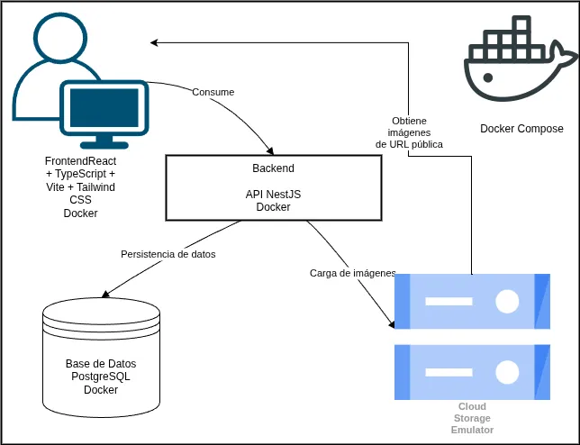
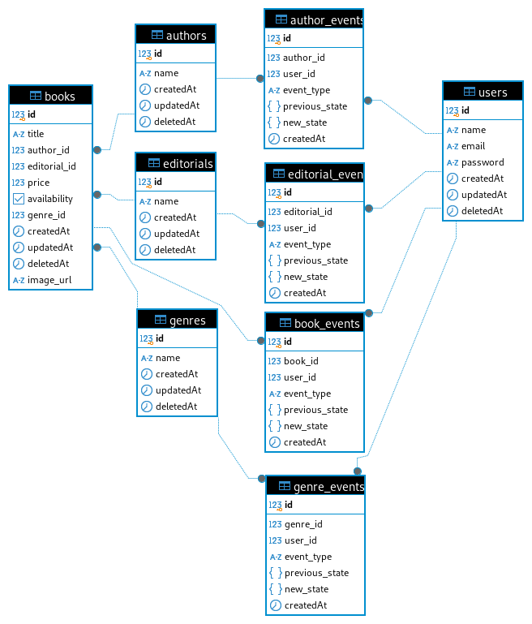

# APIUX Test Project

Este proyecto es una aplicación de gestión de libros que permite registrar, visualizar, editar y exportar libros. Está desarrollada con **NestJS** en el backend y **React + TypeScript** en el frontend. Utiliza Docker y docker-compose para el despliegue automático, incluyendo emulación de servicios como Google Cloud Storage.

---

## 🛠️ Instalación y configuración

### Requisitos

- Docker
- Docker Compose

### Instalación y despliegue

1. Clona el repositorio:

```bash
git clone git@github.com:Alejors/apiux_test.git
cd apiux_test
```

2. Crea un archivo `.env`tomando como referencia las variables presentes en `.env.example`.

```bash
cp .env.example .env
```

3. Levanta los servicios:

```bash
docker-compose up --build
```

Esto levantará:

- Backend NestJS
- Frontend React
- Base de datos
- Emulador de GCS

> El backend estará accesible en `http://localhost:3000`
> El frontend estará accesible en `http://localhost:5173`

4. Corre las migraciones de la base de datos:

```bash
docker-compose exec api npm run migrations:run
```

Esto sincronizará la base de datos, creando las tablas necesarias para usar la API.

5. (opcional) Se agregó un seeder para precargar un usuario y tener libros ya listos para visualizar.

```bash
docker-compose exec api npm run seeders:run
```

## 🚀 Guía de uso

1. Accede a `http://localhost:5173`
2. Inicia sesión con el usuario pre-cargado:

   - **Email:** `admin@email.test`
   - **Contraseña:** `123456` (hasheada en el seeder)

ó

    Crea un usuario en la vista de registro.

3. Desde la aplicación puedes:
   - Visualizar todos los libros
   - Crear nuevos libros
   - Editar libros existentes
   - Subir una imagen para cada libro
   - Exportar la lista de libros en formato CSV
   - Acceder a la vista de Búsqueda Avanzada para filtrar por múltiples condiciones simultáneamente.

---

## 🧱 Arquitectura y decisiones de diseño

- **Frontend (React + Vite):**
  - Validación con React Hook Form + Zod
  - Tailwind CSS para estilos
  - Navegación con react-router-dom
  - Protección de rutas basada en cookie `access_token` + Contexto de autenticación. 

- **Backend (NestJS + Sequelize):**
  - Rutas protegidas por `Guards`
  - Autenticación con JWT y almacenamiento en cookie
  - Carga de imágenes como `multipart/form-data`
  - Exportación CSV vía `/books/export`
  - Emulador de GCS en lugar de servicios en la nube

- **Persistencia:**
  - Sequelize con PostgreSQL
  - Seeders automáticos con usuarios, autores, editoriales, géneros y libros

- **Infraestructura:**
  - Contenedores separados para frontend, backend, DB y emulador GCS
  - Despliegue automático vía `docker-compose`

---

## 📖 API Documentada

> Swagger disponible en: `http://localhost:3000/api`

Incluye:

- Rutas protegidas
- DTOs con validación
- Upload de archivos
- Ejemplos de respuestas

---

## 🖼️ Diagrama de arquitectura

Incluido en `/docs/arquitectura.webp`

- Frontend consume la API REST del backend.
- Imágenes cargadas al emulador GCS.
- Autenticación vía JWT en cookie HttpOnly.



## Decisiones de Diseño

### Autenticación

Para mejorar la seguridad, se optó por manejar el **JWT** mediante una **cookie HTTP-only**, lo que impide su acceso desde JavaScript y reduce el riesgo de ataques **XSS**. Debido a esta elección, se disponibilizó un endpoint cuya única función es responder exitosamente (sin contenido) cuando el cliente posee una cookie válida. En caso de que la cookie haya expirado o sea inválida, se responde con un **401 Unauthorized**.

Desde el front-end, este endpoint es consumido dentro de un *wrapper* que gestiona un contexto global de autenticación. Esta validación se realiza durante la navegación, lo que permite que:

- Usuarios con una sesión activa (validada por la cookie) sean redirigidos automáticamente a las vistas correspondientes, evitando que ingresen nuevamente a las vistas de Log in o Registro.

- Usuarios sin un **JWT** válido no puedan acceder a las vistas protegidas de la aplicación.

### Almacenamiento

Se optó por utilizar un emulador de Google Cloud Storage, ya que permite simular un entorno seguro para el almacenamiento de objetos, sin necesidad de provisionar infraestructura real durante el desarrollo o pruebas. 

El módulo de almacenamiento fue diseñado de forma independiente, permitiendo inyectar el proveedor correspondiente en el módulo de libros. Gracias a esta separación, cambiar el proveedor (por ejemplo, por uno que use almacenamiento propio) solo requiere implementar la interfaz definida, sin afectar el resto del sistema.

### Auditoría

Para el concepto de logging y auditoría se optó por enfrentarlo mediante una estrategia de **Event Sourcing**, donde cada persistencia en la Base de Datos genera un registro en una tabla de eventos, almacenando estado anterior (en caso de existir) y estado nuevo; junto con el ID del usuario que gatilló el Evento. 

Esta estrategia es robusta especialmente pensando en despliegues de Bases de Datos en la nube desplegadas en alta disponibilidad (HA, por sus siglas en inglés), donde habrá múltiples réplicas en diferentes zonas de disponibilidad. Esto, junto con puntos de restauración bien definidos según las necesidades, generan un sistema de logging y auditoría adecuado para los eventos de persistencia.

Esta estrategia también mejora la **trazabilidad del sistema**, permitiendo **reconstruir estados pasados** y facilitar el **análisis ante fallos o inconsistencias**.

### Conteneirización

Si bien el aportar un docker-compose es parte de los requisitos, previamente se había considerado esto debido a la robustez que genera el tener todos los servicios necesarios para un proyecto encapsulados en un único repositorio (o disponibles mediante imágenes en repositorios de imágenes públicos o privados, Artifact Registry o Docker Hub). En este caso se encapsuló los proyectos necesarios (Backend y Frontend) en un único repositorio, y se generó los servicios Docker necesarios: Base de Datos PostgreSQL y Emulador GCS desde repositorios públicos, y API REST y Frontend mediante Dockerfile en sus directorios.

El archivo `docker-compose.yaml` orquesta los servicios necesarios, estableciendo dependencias explícitas y health-checks para garantizar que cada contenedor se inicie en el orden correcto. Por ejemplo, dado que PostgreSQL tarda en estar listo para aceptar conexiones, se configuró la API para esperar hasta que el servicio esté saludable antes de iniciar. Asimismo, el servicio de Frontend espera que el servicio API se haya iniciado.

---

## 🗃️ Modelo relacional

Modelo relacional disponible en `/docs/cmpc_books.png`



---

## 📦 Estructura del proyecto

```
apiux_test/
├── frontend/ (React + Vite + Tailwind)
│   ├── src/
│   │   ├── pages/            # Login, Registro, Crear y Detalles de Libros
│   │   ├── components/       # UI reutilizable (tabla, íconos, botones, header)
│   │   ├── context/          # AuthContext (manejo de sesión)
│   │   ├── services/         # apiFetch, authService, exportService
│   │   ├── types/            # Tipos compartidos (Book, User, ApiResponse)
│   │   └── main.tsx          # Punto de entrada
│   └── public/, Dockerfile, vite.config.ts, etc.
│
├── backend/ (NestJS + Sequelize + JWT + GCS)
│   ├── src/
│   │   ├── modules/
│   │   │   ├── books/               # CRUD + carga de imagen + proyecciones
│   │   │   ├── auth/               # Login, registro, cookies
│   │   │   ├── users/              # Gestión de usuarios
│   │   │   ├── export/             # Exportación CSV
│   │   │   ├── *EventModules/      # Manejo de eventos por entidad (authorEvents, booksEvents, etc.)
│   │   ├── models/                 # Sequelize models (book, user, genre, etc.)
│   │   ├── common/                 # DTOs genéricos, decoradores, guards, utilidades
│   │   ├── config/                 # JWT, Sequelize, etc.
│   │   └── db/                     # Migrations y seeders
│   └── Dockerfile, package.json, nest-cli.json, etc.
│
├── docker-compose.yaml
└── README.md
```

## 🧪 Tests (opcional)

```bash
docker-compose exec api npm run test
```

---

## 🧼 Lint y formato

### Backend

```bash
docker-compose exec api npm run lint
```

### Frontend

```bash
docker-compose exec front npm run lint
```

---